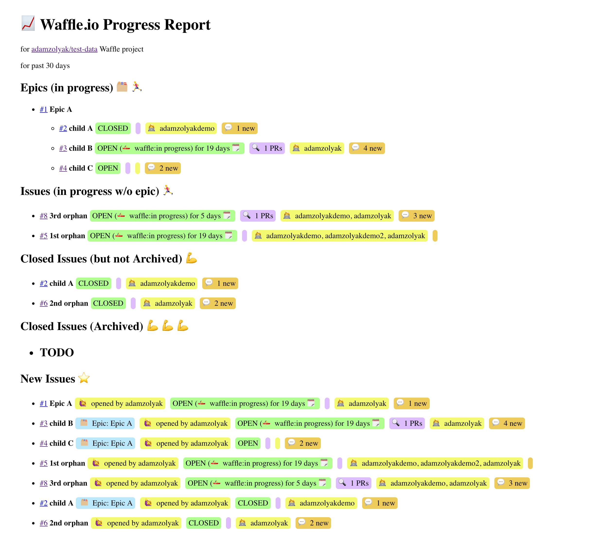

# 📆 Waffle Weekly

A report of weekly progress for Waffle.io projects (boards).

## Overview

Some Waffle.io users need to share status with stakeholders outside of the team members who use a Waffle.io project on a daily basis. These stakeholders might be leadership, clients, or other teams who aren't reviewing the Waffle.io project on a frequent basis or don't have access to GitHub (and therefore don't have access to Waffle.io). While you can [view issues closed in the past 30 days](https://help.waffle.io/faq/done-column-closing-issues/can-i-viewed-my-archived-issues) on Waffle.io's Throughput report, it doesn't provide context about epics, new issues, etc in an easy to consume format.

Waffle Weekly is a project to explore additional progress reporting for Waffle.io projects.

## Roadmap

This project uses Waffle.io for [backlog and in-progress work](https://waffle.io/waffleio/waffleio-weekly).

[](https://waffle.io/waffleio/waffleio-weekly)

## How It Works

Queries the Waffle.io and GitHub APIs for status of GitHub project(s) included in the Waffle.io project (board).

## Usage

1. Clone this repo locally.
2. Create a `dev` file in the root of this project with the following contents and update with the Waffle.io API Key:

```
export waffleApiSecret='123456'

export ghApiToken='123456'

export mailgunUser='123456'
export mailgunPass='123456'
export mailgunFrom='person@example.com'
export mailgunTo='person1@example.com,person2@example.com'

export waffleProject='owner/project'
export inProgressLabels='planned|in progress|needs review|deploying|'

export daysToReport=7

node app.js
```

3. Run `npm install` to install dependencies.
4. Run `npm start` to install dependencies.
5. Open `http://localhost:3000/` in a web browser to view the report in a web browser or open `http://localhost:3000/email` in a web browser to sent an email version of the report

Optionally

- Run `nodemon --exec "bash dev"` to automatically restart the project when changes are made.
- Run `npm test` to run Jest tests in `--watch` mode.

### Explanation of Environment Variables

| Variable         | Description                                                                                                                                                                                                                                             |
| ---------------- | ------------------------------------------------------------------------------------------------------------------------------------------------------------------------------------------------------------------------------------------------------- |
| waffleApiSecret  | Your Waffle API Secret. Contact support@waffle.io to request.                                                                                                                                                                                           |
| ghApiToken       | A [GitHub Personal Access Token](https://blog.github.com/2013-05-16-personal-api-tokens/) with permissions: admin:gpg_key, admin:org, admin:org_hook, admin:public_key, admin:repo_hook, delete_repo, gist, notifications, repo, user, write:discussion |
| mailgunUser      | Your Mailgun user id. Mailgun is free for up to 10,000 emails or 100 authorized users per month.                                                                                                                                                        |
| mailgunPass      | Your Mailgun password.                                                                                                                                                                                                                                  |
| mailgunFrom      | The from address used for email reports.                                                                                                                                                                                                                |
| mailgunTo        | One or more email address(s) used for email reports. Seperate multiple email addresses with a `,` delimiter. You must either 1) use an verified domain in Mailgun or 2) only send email to authorized users in Mailgun.                                 |
| waffleProject    | Your Waffle project (board).                                                                                                                                                                                                                            |
| inProgressLabels | One or more labels the represent the columns on your Waffle project (board) that represents in-progress work. Seperate multiple labels with a `,` delimiter.                                                                                            |
| daysToReport     | The number of days for the report. For example, 7 days for a weekly status report.                                                                                                                                                                      |

## Examples

Example of Waffle Weekly report:


## Resources

- [Waffle.io API Docs](https://docs.waffle.io/)
- [GitHub Actions Docs](https://developer.github.com/actions/)

## Contributing

If you have suggestions for how Waffle.io's GitHub Actions could be improved, or want to report a bug, open an issue! Or pull request! We'd love all and any contributions.

For more, check out the [Contributing Guide](CONTRIBUTING.md).

## License

[ISC](LICENSE) © 2018 Waffle.io <team@waffle.io> (www.waffle.io)
